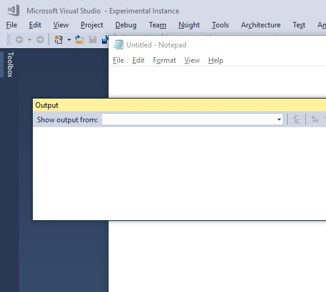

Shmuelie.FreeRangeWindows
=========================

[][2]
[][1]

Most recent versions of Visual Studio do not need this.

Free your tool windows! Windows will now be independent of each other!

[1]: http://vsixgallery.com/extension/Shmuelie.FreeRangeWindows.8d60c8e1-5140-44cc-a2c9-63d79af6473c/
[2]: https://ci.appveyor.com/project/SamuelEnglard/shmuelie-freerangewindows